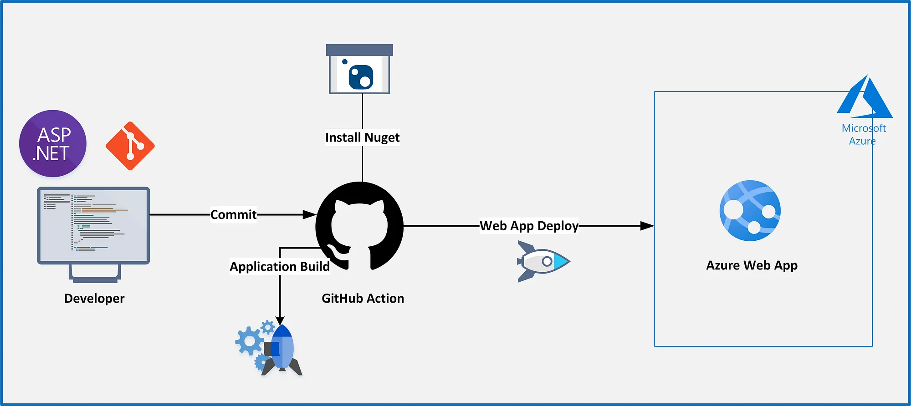

# Portfolio
A simple webapp for my personal webspace. 

## Structure
The site is a static webapp hosted on Azure. It is automatically redeployed when the mainbranch of this repo gets updated. This [Quickstart Guide](https://learn.microsoft.com/en-us/azure/static-web-apps/getting-started) is a great starting point for doing your own. 

Webapp content is currently minimal, but I hope to expand upon it now that I have the infrastructure working. It is connected to my personal domain and operates as travel signpost for people looking for me.

Feel free to fork, just link back to me as appropriate.